# Market Value Prediction of Football Players Project 🎯⚽📊

## Giriş ve Genel Bakış 🌟✨📋
Bu proje, futbol oyuncularının piyasa değerlerini tahmin etmek için veri bilimi ve makine öğrenmesi tekniklerini kullanır. Amacı, oyuncu performans istatistikleri, demografik bilgileri ve takım ilişkilerine dayalı olarak doğru tahminler yapmaktır. Bu rehber, projenin tüm aşamalarını ayrıntılı bir şekilde açıklamaktadır.

## Veri Hazırlama Teknikleri 🛠️📈🔍

### 1. Eksik ve Gereksiz Verilerin Temizlenmesi 🧹✂️💾
- **Eksik Veriler**: Veri setindeki eksik değerler tespit edildi ve uygun yöntemlerle dolduruldu.
  - Örneğin, "Maç", "Gol", "Asist" gibi sayısal sütunlar için eksik değerler sütun ortalaması ile dolduruldu.
  - Kategorik sütunlarda eksik değer olmadığı için ek bir işlem gerekmedi.
```python
# Eksik veri kontrolü
print("Eksik değerler:\n", df.isnull().sum())
```
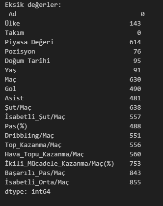

- **Gereksiz Veriler**:
  - "Ad" ve "Doğum Tarihi" gibi modelin performansına katkı sağlamayan sütunlar analizden çıkarıldı.
```python
columns_to_drop = ['Ad','Doğum Tarihi']  # Gereksiz kolonlar
df_cleaned = df_cleaned.drop(columns=columns_to_drop, axis=1)
```
- **Sütunları Türkçeye Çevirme**:
  - Featurelar daha anlaşılır bir hale getirildi.
```python
# Feature isimlerini Türkçeye çevirelim
df.rename(columns={
    'Şut/M': 'Şut/Maç',
    'İ.Ş/M': 'İsabetli_Şut/Maç',
    'Pas': 'Pas(%)',
    'Drip./M': 'Dribbling/Maç',
    'T.K/M': 'Top_Kazanma/Maç',
    'H.T.K/M': 'Hava_Topu_Kazanma/Maç',
    'İ.M.K': 'İkili_Mücadele_Kazanma/Maç(%)',
    'B.P/M': 'Başarılı_Pas/Maç',
    'İ.O/M': 'İsabetli_Orta/Maç',
}, inplace=True)
```

### 2. Sayısal Verilerin Dönüştürülmesi 🔄📉📈
- **Sayısal Verilerin Formatlanması**: Virgül yerine nokta kullanımı sağlanmış ve sayısal sütunlar uygun türlere dönüştürülmüştür.


```python
# Piyasa Değeri sütunundan '.' gibi karakterleri temizleyip, sayıya dönüştürme
df['Piyasa Değeri'] = (
    df['Piyasa Değeri']
    .str.replace('.', '', regex=False)
    .str.replace(',', '.', regex=False)
    .astype(float, errors='ignore')
)

# Sayısal veri içeren diğer sütunları düzeltme
columns_to_clean = ['Şut/Maç', 'İsabetli_Şut/Maç', 'Dribbling/Maç', 'Top_Kazanma/Maç', 'Hava_Topu_Kazanma/Maç', 
                    'İkili_Mücadele_Kazanma/Maç(%)', 'Başarılı_Pas/Maç', 'İsabetli_Orta/Maç', 'Pas(%)', 'Maç', 'Gol', 'Asist']
for column in columns_to_clean:
    df[column] = (
        df[column]
        .str.replace(',', '.', regex=False)
        .str.extract(r'([\d.]+)')
        .astype(float)
    )
```

### 3. Hatalı Değerlerin Düzeltilmesi ve Eksik Verilerin Yönetimi 🛠️💡
- "Yaş" sütunundaki parantezler temizlenmiş ve hatalı yaş değerleri düzeltilmiştir.

```python
# "Yaş" sütunundaki parantezleri temizleme
df['Yaş'] = df['Yaş'].str.extract(r'(\d+)').astype(float)

# Hatalı yaş değerlerini düzeltme
df_cleaned.loc[df['Yaş'] == 0, 'Yaş'] = 25
```

- Eksik değerler, uygun yöntemlerle giderilmiştir.

```python
# Eksik değer içeren satırları silme
df_cleaned = df_cleaned.dropna()

# "Asist" sütununu sayısal formata dönüştürme ve eksik değerleri doldurma
df_cleaned['Asist'] = (
    df_cleaned['Asist']
    .astype(str)
    .str.extract(r'(\d+)')
    .astype(float)
)

df_cleaned['Asist'] = df_cleaned['Asist'].fillna(df_cleaned['Asist'].mean())
```

### 4. Verilerin Kategorize Edilmesi 📊🔢🎨
- "Kaleci" pozisyonunda olan oyuncular veri setinden çıkarılmıştır.

```python
# Pozisyon sütununda "Kaleci" olan oyuncuları filtreleme
df_cleaned = df[~df['Pozisyon'].str.contains("Kaleci", case=False, na=False)]
```

- Kategorik sütunlar sayısal değerlere dönüştürülmüştür.

```python
from sklearn.preprocessing import LabelEncoder
le = LabelEncoder()

# "Takım", "Ad", "Pozisyon" sütunlarını encode etme
df_cleaned['Ülke_encoded'] = le.fit_transform(df_cleaned['Ülke'])
df_cleaned['Takım_encoded'] = le.fit_transform(df_cleaned['Takım'])
df_cleaned['Pozisyon_encoded'] = le.fit_transform(df_cleaned['Pozisyon'])
```

### 5. Kategorik ve Sayısal Sütunların Ayrılması 🏷️📊
- Veri setindeki sütunlar, türlerine göre ayrılmıştır.

```python
# Sütunları kategorik ve sayısal olarak ayırma
categorical_columns = df_cleaned.select_dtypes(include=['object']).columns.tolist()
numerical_columns = df_cleaned.select_dtypes(include=['float64', 'int64']).columns.tolist()
non_categorical_columns = [col for col in df_cleaned.columns if col not in categorical_columns]
```

### 6. Logaritmik Dönüşüm ve Analiz 🔄📈
  - "Piyasa Değeri" sütunu modellerin performans analizi açısından çok fazla büyük değerlere sahip olduğu için logaritmik dönüşüme tabi tutulmuş ve dağılım incelenmiştir:
```python
# Log dönüşüm
df_cleaned['Piyasa Değeri (Log)'] = np.log1p(df_cleaned['Piyasa Değeri'])

# Dağılımı görselleştirme
plt.figure(figsize=(8, 5))
sns.histplot(df_cleaned['Piyasa Değeri (Log)'], bins=20, kde=True, color='purple')
plt.title('Logaritmik Piyasa Değeri Dağılımı')
plt.xlabel('Log(Piyasa Değeri)')
plt.ylabel('Frekans')
plt.grid(axis='y', linestyle='--', alpha=0.7)
plt.show()
```
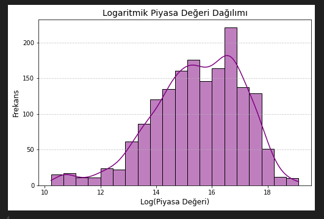

### 7. Grafiksel Analiz ve Görselleştirme 📊📈🎥
- Veri dağılımını anlamak için histogramlar ve kutu grafikleri oluşturuldu.
- Değişkenler arasındaki ilişkiler, korelasyon matrisi ile analiz edildi.

```python
# Korelasyon matrisi
plt.figure(figsize=(12, 8))
correlation_matrix = df_cleaned[numerical_columns].corr()
sns.heatmap(correlation_matrix, annot=True, fmt=".2f", cmap='coolwarm', cbar=True)
plt.title('Korelasyon Matrisi', fontsize=16)
plt.show()
```
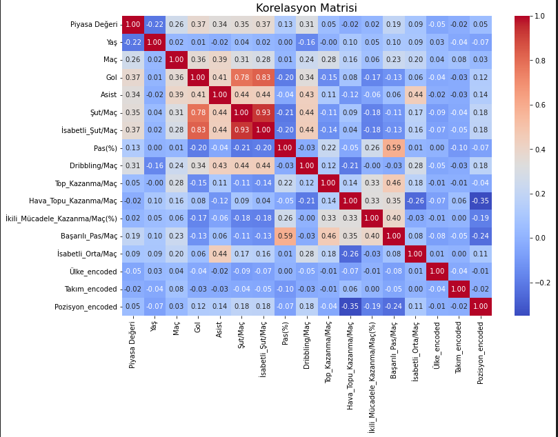

- **Histogram Örneği**:
```python
# Nümerik sütunları seçme
numerical_columns = df_cleaned.select_dtypes(include=['number']).columns

# One-Hot Encoding ile oluşturulan kategorik sütunları seçme
encoded_columns = df_cleaned.select_dtypes(include=['uint8', 'int64','int32']).columns

# 1. Nümerik Sütunlar İçin Histogramlar
for column in numerical_columns:
    plt.figure(figsize=(8, 5))
    sns.histplot(df_cleaned[column], kde=True, bins=20, color='blue', edgecolor='black', alpha=0.7)
    plt.title(f'{column} Dağılımı', fontsize=14)
    plt.xlabel(column, fontsize=12)
    plt.ylabel('Frekans', fontsize=12)
    plt.grid(axis='y', linestyle='--', alpha=0.7)
    plt.show()

# 2. One-Hot Encoding ile Oluşan Kategorik Sütunlar İçin Histogramlar
for column in encoded_columns:
    plt.figure(figsize=(8, 5))
    sns.histplot(df_cleaned[column], kde=False, discrete=True, color='green', edgecolor='black', alpha=0.7)
    plt.title(f'{column} Dağılımı (One-Hot Encoding)', fontsize=14)
    plt.xlabel(column, fontsize=12)
    plt.ylabel('Frekans', fontsize=12)
    plt.grid(axis='y', linestyle='--', alpha=0.7)
    plt.show()
```
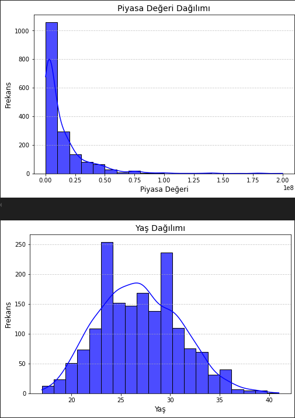
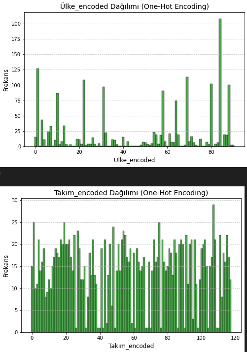
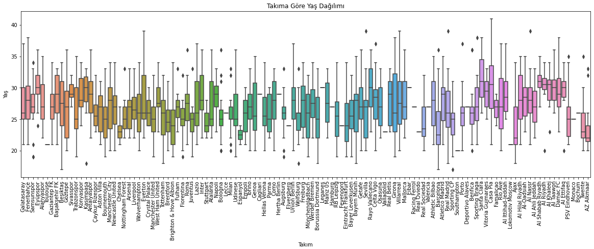
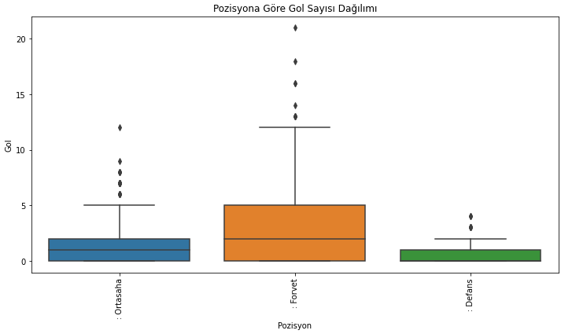
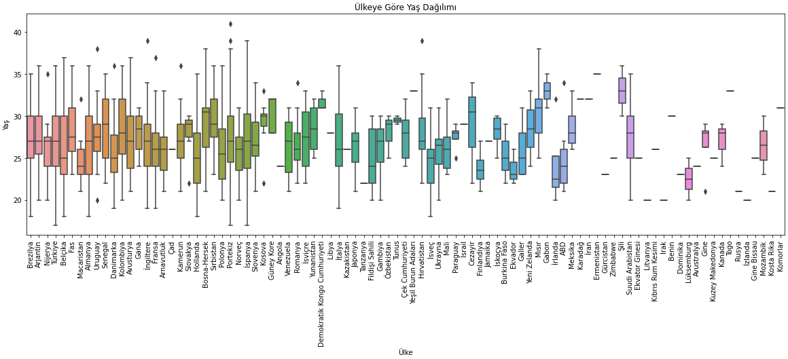

### 8. İşlenebilir Verinin Elde Edilmesi 🏗️✅📂
Bu adımlar sonucunda, eksiksiz, kategorik verileri sayısal hale getirilmiş ve uç değerlerden arındırılmış bir veri seti elde edilmiştir. Bu veri, makine öğrenmesi modelleri için hazır hale getirilmiştir.

---

## Makine Öğrenmesi Algoritmalarının Uygulanması ve İyileştirilmesi 🤖💡📚

### 1. Modellerin Tanıtılması 📝🧠📋
Bu proje kapsamında aşağıdaki makine öğrenmesi algoritmaları uygulanmıştır:
- **Linear Regression**
- **Random Forest**
- **Decision Tree**
- **XGBoost**

### 2. Eğitim ve Test Verilerinin Hazırlanması 📂🔍📊
- Veri seti, %80 eğitim ve %20 test olarak ayrılmıştır.
- Logaritmik dönüşüm yapılmış "Piyasa Değeri (Log)" hedef değişken olarak kullanılmıştır.

```python
# Hedef değişken ve bağımsız değişkenler
X = df_cleaned.drop(columns=['Ad','Piyasa Değeri', 'Piyasa Değeri (Log)','Doğum Tarihi','Ülke','Pozisyon','Takım'])
y = df_cleaned['Piyasa Değeri (Log)']

# Veri setini eğitim ve test olarak ayırma (%80 eğitim, %20 test)
X_train, X_test, y_train, y_test = train_test_split(X, y, test_size=0.2, random_state=42)

# Bölünmüş veri setini kontrol etme
X_train.shape, X_test.shape, y_train.shape, y_test.shape
```

### 3. Modellerin Eğitilmesi 🏋️‍♂️⚙️📈
Her bir algoritma, eğitim verisi üzerinde eğitilmiş ve test verisi üzerinde değerlendirilmiştir.

```python
# Örnek: XGBoost Modeli
xgb_model = XGBRegressor(random_state=22, n_estimators=200, learning_rate=0.2, max_depth=5)
xgb_model.fit(X_train, y_train)
y_pred_xgb = xgb_model.predict(X_test)

# RandomForestRegressor Modeli
regr = RandomForestRegressor(n_estimators=100)
regr.fit(X_train, y_train)
y_pred_regr = regr.predict(X_test)

# LinearRegression Modeli
# Eksik veriler, SimpleImputer ile doldurulmuş ve ardından model eğitilmiştir.
imputer = SimpleImputer(strategy='mean')
X_train_imputed = imputer.fit_transform(X_train)
X_test_imputed = imputer.transform(X_test)
lr = LinearRegression()
lr.fit(X_train_imputed, y_train)
y_pred_lr = lr.predict(X_test_imputed)

# DecisionTreeRegressor Modeli
dt_reg = DecisionTreeRegressor()
dt_reg.fit(X_train, y_train)
y_pred_dt_reg = dt_reg.predict(X_test)
```
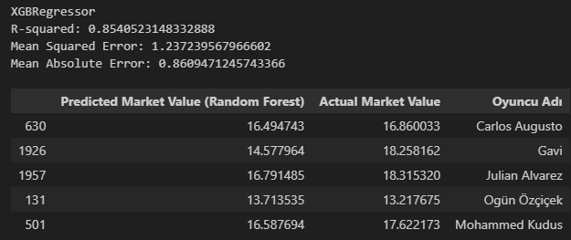

### 4. Performans Değerlendirme 📋📉✅
Modellerin performansı, Mean Squared Error (MSE) ve R² Skoru kullanılarak değerlendirilmiştir.

```python
# Performans değerlendirme
print("XGBRegressor")
print("R-squared:", r2_score(y_test, y_pred_xgb))
print("Mean Squared Error:", mean_squared_error(y_test, y_pred_xgb))
print("Mean Absolute Error:", mean_absolute_error(y_test, y_pred_xgb))

print("RandomForestRegressor")
print("R-squared:", r2_score(y_test, y_pred_regr))
print("Mean Squared Error:", mean_squared_error(y_test, y_pred_regr))
print("Mean Absolute Error:", mean_absolute_error(y_test, y_pred_regr))

print("Linear Regression")
print("R-squared:", r2_score(y_test, y_pred_lr))
print("Mean Squared Error:", mean_squared_error(y_test, y_pred_lr))

print("Decision Tree Regressor")
print("R-squared:", r2_score(y_test, y_pred_dt_reg))
print("Mean Squared Error:", mean_squared_error(y_test, y_pred_dt_reg))
```


### 5. Modellerin Karşılaştırılması 🥇🥈🥉
Aşağıda, uygulanan algoritmaların performans karşılaştırması verilmiştir:

| Model               | MSE   | R² Skoru |
|---------------------|--------|----------|
| Linear Regression   | 1.7333 | 0.655190 |
| Random Forest       | 1.2790 | 0.837311 |
| Decision Tree       | 2.6346 | 0.293911 |
| XGBoost             | 1.2372 | 0.854052 |

### 6. En İyi Modelin Belirlenmesi ve Hiperparametre Optimizasyonu ✨
```python
best_model = performance_df.loc[performance_df['R2 Score'].idxmax()]
print("En İyi Model:\n", best_model)

# Hiperparametre arama fonksiyonu
def grid_search_xgb(X_train, y_train, X_test, y_test):
    best_r2 = -float('inf')
    best_params = None

    for n_estimators in [50, 100, 200]:
        for learning_rate in [0.01, 0.1, 0.2]:
            for max_depth in [3, 5, 7]:
                model = XGBRegressor(n_estimators=n_estimators, learning_rate=learning_rate, max_depth=max_depth, random_state=22)
                model.fit(X_train, y_train)
                y_pred = model.predict(X_test)
                r2 = r2_score(y_test, y_pred)

                if r2 > best_r2:
                    best_r2 = r2
                    best_params = {'n_estimators': n_estimators, 'learning_rate': learning_rate, 'max_depth': max_depth}

    return best_params, best_r2

# Hiperparametre arama
best_params, best_r2 = grid_search_xgb(X_train, y_train, X_test, y_test)

print("En iyi parametreler:", best_params)
print("En iyi R2 skoru:", best_r2)

# En iyi parametrelerle modeli yeniden eğitme
best_model = XGBRegressor(**best_params, random_state=22)
best_model.fit(X_train, y_train)
y_pred_best = best_model.predict(X_test)

print("Mean Squared Error (MSE):", mean_squared_error(y_test, y_pred_best))
print("Mean Absolute Error (MAE):", mean_absolute_error(y_test, y_pred_best))
```
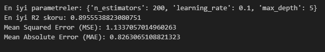

### 7. Gerçek vs. Tahmin Görselleştirmesi 🎨
```python
plt.figure(figsize=(10, 6))
plt.scatter(y_test, y_pred_xgb, alpha=0.6, color='blue')
plt.plot([y_test.min(), y_test.max()], [y_test.min(), y_test.max()], '--r', linewidth=2)
plt.title('Gerçek vs. Tahmin (XGBoost)')
plt.xlabel('Gerçek Piyasa Değeri')
plt.ylabel('Tahmin Edilen Piyasa Değeri')
plt.show()
```
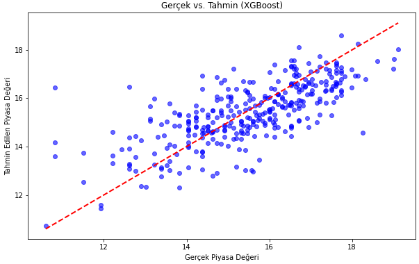

---

## Sonuç Analizi 🏁🔎✨

### 1. Modellerin Performans Değerlendirmesi 📈✅🧮
- Uygulanan modeller arasında en iyi performansı gösteren model, XGBoost olmuştur. XGBoost, düşük MSE ve yüksek R² skoru ile diğer algoritmalardan üstün performans sergilemiştir.
- Linear Regression modeli, basitliği nedeniyle hızlı bir çözüm sunmuş ancak doğruluk oranı sınırlı kalmıştır.
- Random Forest, doğruluk oranı yüksek bir model olarak etkili sonuçlar üretmiştir.

### 2. Model Sonuçlarının Yorumlanması 🧠💬🔍
- Yüksek korelasyon gösteren değişkenler, model performansını olumlu etkilemiştir.
- "Yaş" ve "Pozisyon" değişkenlerinin piyasa değeri üzerinde belirgin bir etkisi olduğu gözlemlenmiştir.

### 3. Öne Çıkan Bulgular 🌟📊📚
- Verilerin logaritmik dönüşüm ile işlenmesi, model performansını önemli ölçüde artırmıştır.
- Eksik ve uç değerlerin doğru şekilde yönetilmesi, veri kalitesini yükseltmiş ve model doğruluğunu artırmıştır.

### 4. Geliştirme Önerileri 🚀💡🔮
- Daha geniş bir veri seti ile modellerin tekrar eğitilmesi, daha doğru sonuçlar sağlayabilir.
- Model optimizasyonu için GridSearchCV veya Bayesian Optimization yöntemleri kullanılabilir.
- Projenin bir web uygulamasına dönüştürülmesi, daha geniş bir kullanıcı kitlesine ulaşmayı sağlayabilir.

---

Proje, futbol oyuncularının piyasa değerini tahmin etmede başarılı bir çözüm sunmuş ve makine öğrenmesi tekniklerinin etkili bir şekilde uygulanabileceğini göstermiştir. Gelecekte yapılacak geliştirmelerle bu tür projeler daha geniş kapsamlı hale getirilebilir. 🌍📈⚽
